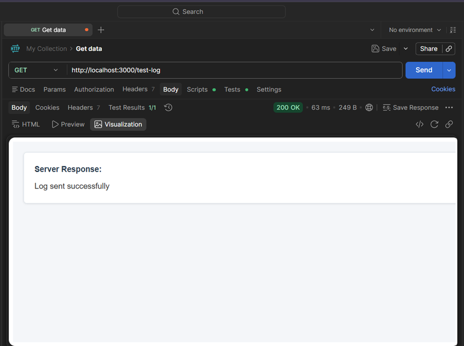
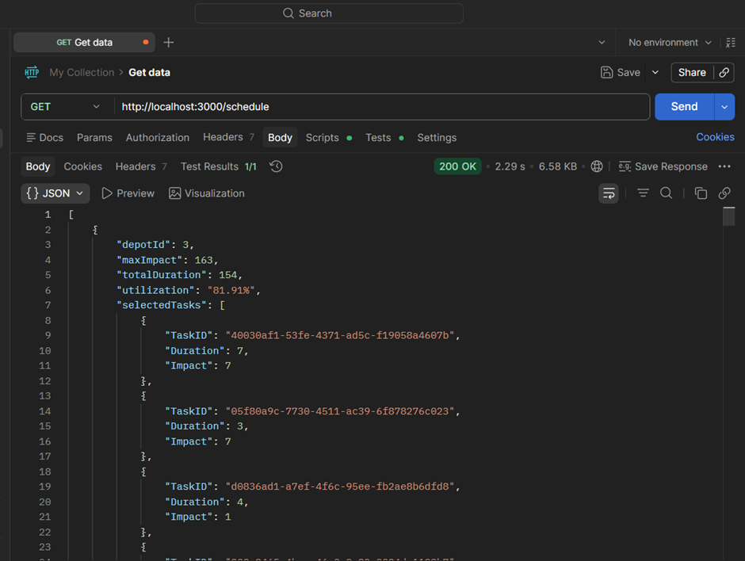
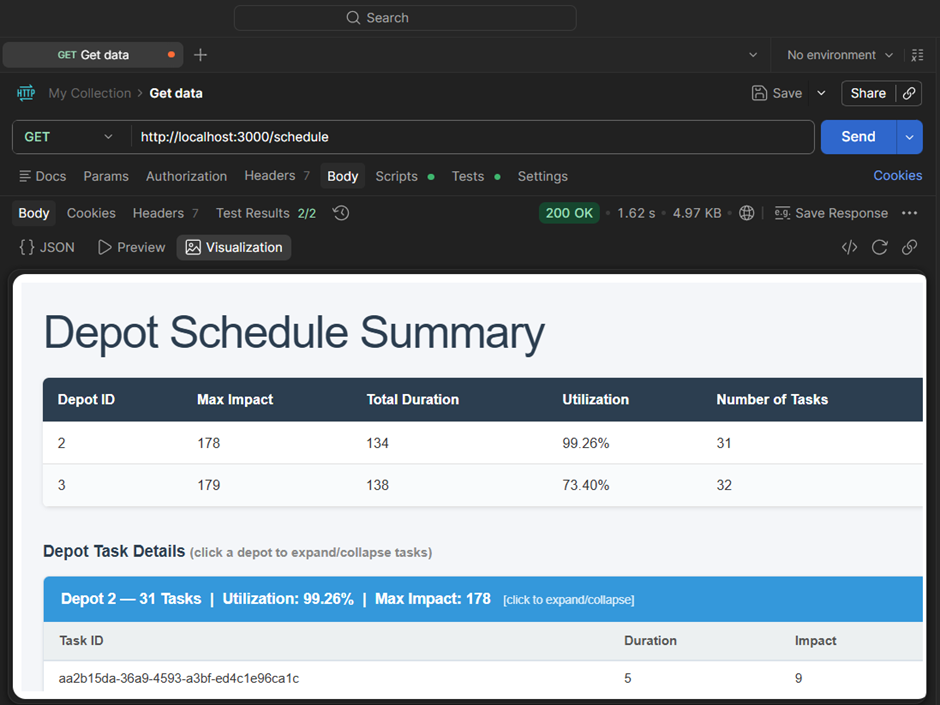
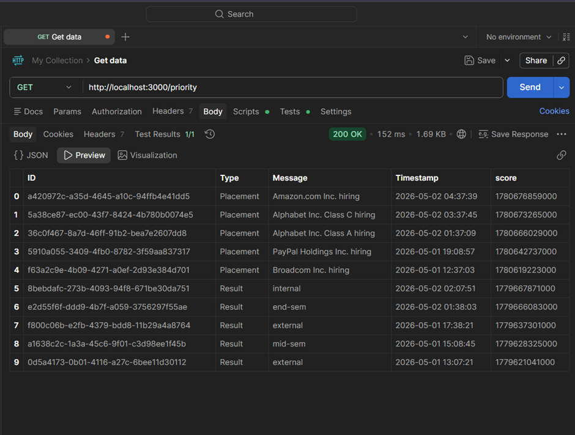

# Vehicle Scheduler Backend 🚗⚙️

A backend microservice system designed to optimize vehicle maintenance scheduling and manage notification systems efficiently.

---

## 📌 Features

* 🔹 Logging Middleware with external API integration
* 🔹 Vehicle Maintenance Scheduler (Knapsack-based optimization)
* 🔹 Priority Notification System (Placement > Result > Event)
* 🔹 REST APIs for scheduling and logging
* 🔹 System Design for scalable notification architecture

---

## 🏗️ Project Structure

```
vehicle-scheduler-backend/
│
├── logging_middleware/
│   ├── auth.js
│   └── logger.js
│
├── vehicle_maintenance_scheduler/
│   ├── scheduler.js
│   └── server.js
│
├── notification_app_be/
│   └── priority.js
│
├── screenshots/
│
├── notification_system_design.md
├── package.json
├── .gitignore
```

---

## ⚙️ Setup Instructions

```bash
npm install
node vehicle_maintenance_scheduler/server.js
```

Server runs on:

```
http://localhost:3000
```

---

## 📡 API Endpoints

### 1. Test Logging

```
GET /test-log
```

### 2. Vehicle Scheduler

```
GET /schedule
```

### 3. Priority Notifications

```
GET /priority
```

---

## 📊 Output Screenshots

### 🔹 Logging Middleware Test



---

### 🔹 Vehicle Scheduling Output



---

### 🔹 Scheduler Visualization



---

### 🔹 Priority Notifications (Stage 6)




```


## 🧠 Approach

### Vehicle Scheduling

* Used greedy/knapsack-based approach
* Maximizes impact under time constraints
* Handles large input efficiently

### Logging Middleware

* Centralized logging function
* Sends logs to external API
* Supports levels: debug, info, warn, error, fatal

### Notification System

* Priority-based ranking system:

  * Placement > Result > Event
* Sorted by recency + importance
* Returns top N notifications efficiently

---

## ⚡ Tech Stack

* Node.js
* Express.js
* Axios

---

## 📌 Notes

* No personal details included in repository as per guidelines
* External APIs used for data fetching
* Designed with scalability and production practices in mind

---

## 🚀 Author

Backend Developer | System Design Enthusiast
